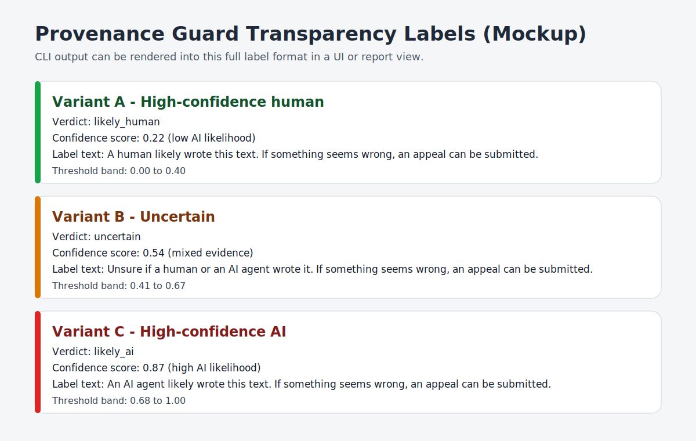
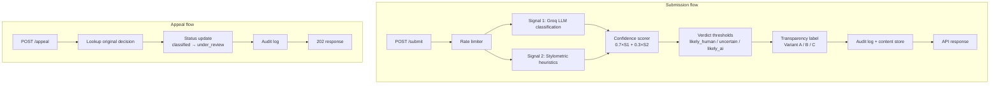

# Provenance Guard

Provenance Guard is a small Flask API that estimates whether submitted text was likely written by a human or by AI, then records the decision in an audit log and supports appeals.

## Project Overview

The service exposes two endpoints:

- `POST /submit` classifies a text submission, stores the decision, and returns a transparency label.
- `POST /appeal` marks a prior decision as under review and preserves the original classification data.

The app is intentionally simple, but the design is meant to reflect a realistic moderation workflow: use more than one detection signal, keep the final decision explainable, and preserve a durable audit trail.

## Setup

1. Create and activate a virtual environment.
2. Install dependencies with `pip install -r requirements.txt`.
3. Set `GROQ_API_KEY` in your environment.
4. Optionally set `GROQ_MODEL` if you want to override the default model.
5. Run the server with `python app.py`.

The app also respects `RATELIMIT_STORAGE_URI`, which defaults to in-memory rate limiting.

## Submission Checklist Coverage

This README covers the required submission pieces:

- Project summary
- Setup and run instructions
- API behavior
- Detection signals
- Confidence scoring
- Transparency labels
- Appeals workflow
- Audit logging
- Rate limiting
- Testing notes
- Limitations and real-world improvements

## API Endpoints

### `POST /submit`

Request body:

```json
{
	"text": "The submitted content to evaluate.",
	"creator_id": "student-123",
	"content_id": "optional-id"
}
```

Behavior:

- Rejects requests missing `text` or `creator_id`.
- Generates a `content_id` if one is not supplied.
- Runs both detection signals.
- Combines the scores into one confidence score and verdict.
- Generates a transparency label.
- Writes the result to `audit_log.jsonl` and updates `content_store.json`.

Response fields include:

- `combined_attribution_result`
- `confidence_score`
- `signal_1_score`
- `signal_2_score`
- `signal_1_error` and `signal_2_error` when a signal fails
- `transparency_label`

### `POST /appeal`

Request body:

```json
{
	"content_id": "existing-content-id",
	"creator_id": "student-123",
	"statement": "Why I believe the decision is incorrect."
}
```

Behavior:

- Looks up the most recent classified decision for the content ID.
- Rejects unknown content IDs.
- Moves the stored status to `under_review`.
- Logs the appeal statement and the original decision.

## Detection Signals

### Signal 1: LLM Classification

Signal 1 sends the text to Groq and asks the model to return a probability that the passage is AI-generated. I use this signal because an LLM can capture higher-level patterns that are hard to express as simple rules: semantic coherence, discourse structure, repetition that is subtle rather than literal, and the overall “shape” of the writing.

That is valuable because AI-generated writing often looks polished in ways that are not obvious from token counts or punctuation alone. A rules-only approach would miss those signals. The tradeoff is that the model is not deterministic in the same way as a heuristic, so it can be sensitive to prompt wording, model choice, and the style of the input. In practice, I would keep this signal but add offline evaluation, prompt versioning, and periodic calibration against labeled examples.

### Signal 2: Stylometric Heuristics

Signal 2 scores the text using three simple measurements: sentence-length variance, type-token ratio, and punctuation density. I use this signal because it is cheap, deterministic, and independent from the LLM. It is useful as a second opinion when the LLM is unavailable or when we want a sanity check against obviously repetitive or overly uniform text.

The logic here is that many AI outputs are more regular than natural writing. They tend to reuse similar sentence lengths, keep vocabulary diversity lower than a strong human sample, and use punctuation in a more uniform way. This is not a perfect rule, and it should not be treated as one. Short texts, poetry, very polished human prose, and heavily edited AI text can all break these assumptions. If I were deploying this for real, I would treat this signal as a lightweight feature source, not as a standalone detector, and I would validate it on domain-specific examples before trusting the score.

## Confidence Scoring

The final confidence score combines the two signals with a 70/30 weighting that favors Signal 1.

```text
combined_score = 0.7 * signal_1 + 0.3 * signal_2
```

I chose this weighting because the LLM signal is the more expressive one: it can evaluate semantics, structure, and writing style in a way the heuristic signal cannot. The stylometric signal still matters, but mostly as a secondary check that nudges the score when the two signals disagree. If both signals are high, the result is more trustworthy. If they diverge, the system should lean toward caution rather than pretending to be certain.

The current verdict thresholds are:

- `0.00` to `0.40`: `likely_human`
- `0.41` to `0.67`: `uncertain`
- `0.68` to `1.00`: `likely_ai`

Those bands give the system room to abstain when the evidence is mixed. In a real deployment, I would not keep these exact numbers by default. I would calibrate them on a labeled validation set, measure false positives carefully, and probably tune them by content type. I would also consider a more formal calibration method, such as logistic regression or isotonic calibration, if we had enough training data.

## Transparency Labels

The API maps the verdict to one of three user-facing labels:

- Variant A: likely human
- Variant B: uncertain
- Variant C: likely AI

Each label also includes the same appeal guidance so the user has a clear next step if they disagree with the result.

### Full Label Mockup (All Variants)

Because this project is CLI-first, this README includes a mockup of the full transparency label design rather than an in-app screenshot.



The mockup shows all required variants in one design:

- High-confidence human (`likely_human`)
- Uncertain (`uncertain`)
- High-confidence AI (`likely_ai`)

To match the implementation exactly, the mockup uses the same label text generated in `signals/labels.py`:

- Variant A (`likely_human`): "A human likely wrote this text. If something seems wrong, an appeal can be submitted."
- Variant B (`uncertain`): "Unsure if a human or an AI agent wrote it. If something seems wrong, an appeal can be submitted."
- Variant C (`likely_ai`): "An AI agent likely wrote this text. If something seems wrong, an appeal can be submitted."

## Appeals Workflow

Appeals are designed to preserve the original decision rather than overwrite it. That matters because provenance systems should be auditable. If a creator disputes a result, the system needs to show what was decided, when it was decided, and what information the reviewer would need to re-check it.

When an appeal is submitted, the content is moved to `under_review`, the original decision is stored with the appeal, and a new audit entry is appended. That gives you both the original classification and the appeal history in the record.

## Audit Trail

Every submission and appeal is appended to `audit_log.jsonl` as a JSONL record. The log includes:

- timestamp
- content ID
- both signal scores
- combined confidence score
- combined verdict
- status
- appeal metadata when present

The content store in `content_store.json` keeps the latest per-item status so the API can answer appeal requests without re-running classification.

## Rate Limiting

`POST /submit` is limited to `5 per minute` and `30 per hour` per `creator_id` when available, otherwise per client IP.

This is a practical anti-abuse boundary. The minute window allows a normal burst of legitimate submissions, while the hourly window prevents scripted flooding and repeated probing. In a real deployment, I would probably move this to a shared backend such as Redis so limits work across multiple app instances.

## Testing

The test suite uses `unittest` and focuses on deterministic behavior:

- Signal 2 returns bounded scores and separates human-like from repetitive text.
- Signal 1 is mocked so the tests do not depend on a live Groq call.
- The scorer is checked against the documented thresholds.
- The transparency labels are verified across all three variants.
- The audit log is checked for the expected structure.

Run the tests with:

```bash
python -m unittest
```

## Architecture



## Limitations And Real-World Improvements

This system will make mistakes, and some are predictable from how the signals are designed.

Known limitations:

- Highly polished, formulaic human writing (for example: personal statements, cover letters, or policy memos) can be mislabeled as AI. Signal 2 can interpret low sentence-length variance and uniform punctuation as AI-like regularity, and Signal 1 can also over-associate templated tone with AI writing.
- Heavily edited AI drafts can be mislabeled as human. Once a person rewrites wording and sentence rhythm, type-token ratio and variance become more human-like, which weakens Signal 2, and Signal 1 may see the final text as plausibly human-authored.
- Very short content (single paragraphs, captions, chat replies) is unstable. Stylometric features are noisy at small sample sizes, and the LLM signal has too little context for a confident judgment.
- As models improve, style-based differences shrink. That directly reduces the usefulness of heuristic cues, so Signal 2 cannot be treated as an end-all detector and needs ongoing redesign and validation.

If I were deploying this for real, I would make these improvements:

- Calibrate the scoring on labeled data instead of relying on hand-picked weights and thresholds.
- Add more robust fallback behavior when one signal fails, rather than dropping to an `unknown` result.
- Track per-domain and per-language performance, because one set of thresholds will not fit every writing style.
- Move audit storage to a durable database instead of flat files.
- Use a shared rate-limit backend for multi-instance deployment.
- Add monitoring for false positives, especially on short, edited, or highly formal human writing.

The goal of the current version is to show a transparent, explainable pipeline. The goal of a production system would be to make that pipeline measurable, calibrated, and easy to review under changing conditions.

## AI Usage
1. I had directed the AI to provide me with sample curl commands I could use, but it had failed in providing me that.
2. I had use Ai to help create the variants mockup and it worked out pretty well. 

## Demo Video
https://www.loom.com/share/a0404a081a114a9b80d3f1bca0a0aa11