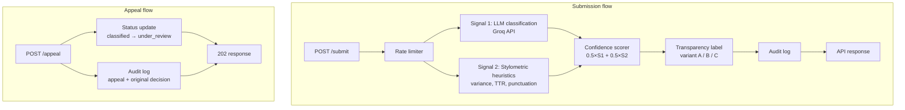

## Detection Signals:

**Signal 1 - LLM Classification**: Sends a text request to Groq with a prompt asking it to assess whether the writing reads as human or AI generated. It would capture the semantic and stylistic coherece holistcally. The output would be a number between 0 - 1 where 1 would be that the text is highly likely that it is AI generated and 0 is the opposite.

**Signal 2 - Stylometric Heuristics**: Would compute the structual properties in pure python such as the variance in sentence length, vocabulatry diversty and punctuation density. Text that is highly AI generated would be more uniform across the board where as human writing would have more variance to it. Output would also be a number between 0 and 1 where 1 is highly likely that it is AI generated and 0 being human generated. It would also be the average across the 3 metrics. 

To combine it into one confidence metric I would multiple each signal by .5 before adding it together to get the resulting confidence score.

## Uncertainty Representation:

Any score that is 0.40 or lower would mean that it is likely human generated where as a score of 0.60 would mean that the signals are mixed and hard to determine the confidence verdict. The following would be my thresholds for each level:
- 0.00 - 0.40 = Likely Human
- 0.41 - 0.69 = Uncertain
- 0.70 - 1.00 = Likely AI

## Transparency Label Design:

**A - Likely Human**:
- A human likely wrote this text. If something seems wrong, an appeal can be submitted.

**B - Uncertain**:
- Unsure if a human or an AI agent wrote it. If something seems wrong, an appeal can be submitted.

**C - Likely AI**:
- An AI agent likely wrote this text. If something seems wrong, an appeal can be submitted.

## Appeals Workflow:

Any creator will be allowed to submit an ID, with the associated `content_id` and a brief statement. Upon reciept of the appeal the status of the text would be changed from `classified` to `under_review`, with an audit entry on the original data. A human will review the original data shown to the user along with the statement to determine if it is AI generated or not. 

## Anticipated Edge Cases:

- Poetry: Short lines with plain vocabulary (i.e haiku, etc) would high high on the 2nd signals metrics, landing it in the real of Likely AI, despite it being human authored
- Varied AI text: By having an LLM provide different lengths and unusual words would defeat the second signal, same for a well instructed model may trick signal 1. This would likely result in the score being uncertain rather than being labeled as likely AI.

## Architecture

A submission enters POST /submit, passes rate limiting, runs through both signals in parallel, and the combined score maps to a transparency label before everything is written to the audit log and returned. Appeals follow a separate path — POST /appeal updates the content status to under_review and logs the creator's statement alongside the original decision without triggering re-classification.

## AI Tool Plan

**M3 (Submission endpoint and First signal)**
Provide: Detection signals section + architecture diagram.
Ask for: Flask app skeleton with `POST /submit` and the Groq classification
function as a standalone module.
Verify: Call the function directly with a known AI-generated text and a known
human-written text and confirm the scores differ in the expected direction before
wiring it into the endpoint.

**M4 — Signal 2 + confidence scoring**
Provide: Detection signals section + uncertainty representation + architecture
diagram.
Ask for: Stylometric heuristics function (sentence length variance, type-token
ratio, punctuation density) + scoring combiner that returns a float and a verdict
string.
Verify: Run both signals on the same test texts from M3 and confirm the combined
score lands in `likely_human` for the human text and `likely_ai` for the AI text.
If scores cluster near 0.5, revisit the heuristic weights.

**M5 — Production layer**
Provide: Transparency label variants + appeals workflow + architecture diagram.
Ask for: Label generator mapping score → variant text, `POST /appeal` endpoint,
and audit log writer.
Verify: Manually trigger all three score ranges and confirm the correct label
variant is returned each time. Submit a test appeal and confirm the status updates
to `under_review` in the audit log.